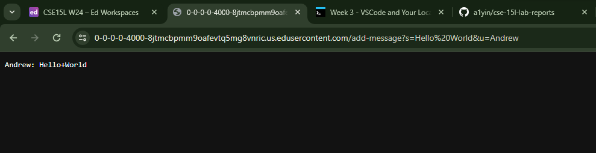
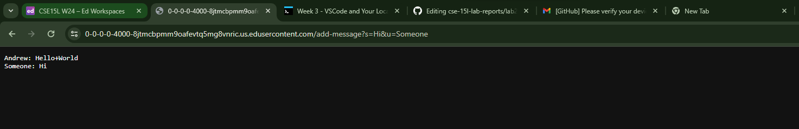
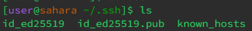
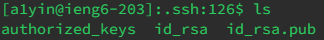
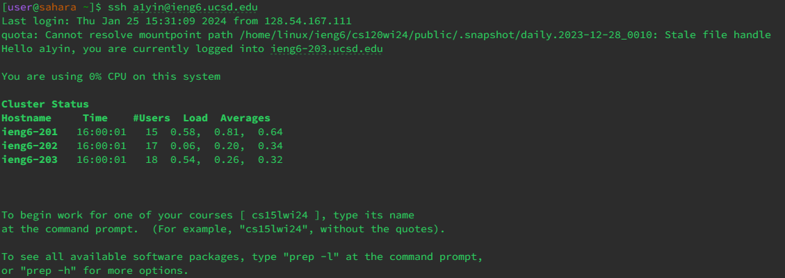

# Part 1
ChatServer Code
```
import java.io.IOException;
import java.net.URI;
import java.util.HashMap;

class Handler implements URLHandler {
    HashMap<String, String> userMessageMap = new HashMap<String, String>();

    public String handleRequest(URI url) {
        if (url.getPath().equals("/add-message")) {
            String[] parameters = url.getQuery().split("&");
            String userMessage = parameters[0].split("=")[1];
            String user = parameters[1].split("=")[1];

            userMessageMap.put(user, userMessage);

            String messages = "";
            for (String u : userMessageMap.keySet()) {
                messages += u + ": " + userMessageMap.get(u) + "\n";
            }
            return messages;

        } else {
            return "404 Not Found!";
        }
    }
}

class ChatServer {
    public static void main(String[] args) throws IOException {
        if(args.length == 0){
            System.out.println("Missing port number! Try any number between 1024 to 49151");
            return;
        }

        int port = Integer.parseInt(args[0]);

        Server.start(port, new Handler());
    }
}
```
Screenshot 1

* Starting the main method in the ChatServer class, a static method from the Server class starts the server, and inputting a `Handler` object. In this object, there exists a `handleRequest` method, which takes the URL input from the user and does some action describes in the method.
* The static method `start` in the `Server` class takes input an integer port and a `Handler` object. The `handleRequest` method in the object takes in an URL of type URI and returns a string. The port field is always an integer that is parsed from `args[0]`. All messages and users are input into the HashMap as strings.
* In this request, the Hash Map gets added an entry of key `Andrew` and value `Hello World`. The fields within the if-block are also set based on the '&' and '=' splits. The port number is not changed in the `handleRequest` method

Screenshot 2

* The static method from the Server class starts the server, and inputting a `Handler` object. In this object, there exists a `handleRequest` method, which takes an URL input from the user and does some action describes in the method.
* The static method `start` in the `Server` class takes input an integer port and a `Handler` object. The `handleRequest` method in the object takes in an URL of type URI and returns a string. The port field is always an integer that is parsed from `args[0]`. All messages and users are input into the HashMap as strings.
* In this request, the Hash Map gets added another entry of key `Someone` and value `Hi`, now there being 2 keys in the map. The fields within the if-block are set based on the '&' and '=' splits of the new URL. The port number is not changed in the `handleRequest` method.

# Part 2
## Public Key

## Private Key



# Part 3
Something I learned from lab in week 2 was using the query in a URL to interact with certain parts of a program. I thought that was pretty interesting, as well as deploying our own server.


